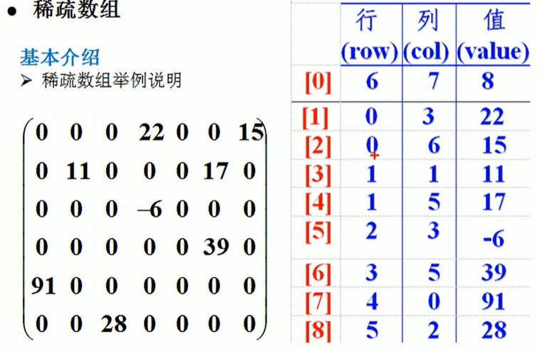

# Common Data Structures
## 1. Linear DS
+ 数据元素之间一对一的关系；
+ 顺序存储结构（顺序表），链式存储结构（链表）
+ typical linear structures: array, queue, linkedList, stack

### 1.1 Sparse Array

## 2. Non-linear DS
typical non-linear structures:
+ multi-dimension array
+ table
+ tree
+ graph

Demo of sparse array

